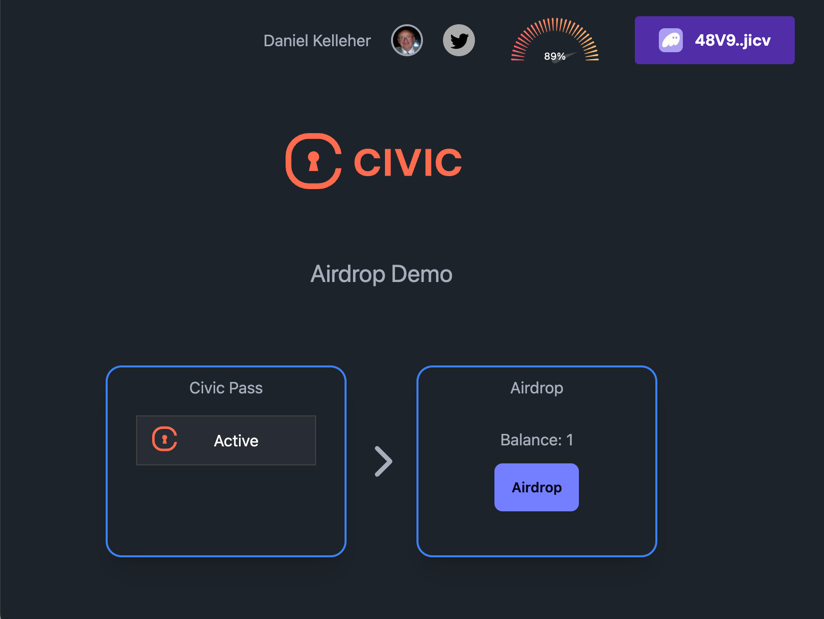

# Solana Civic Workshop - Airdrop

A simple airdrop program to demonstrate the use of Civic to protect on-chain assets.



## Run Locally

Note: by default, the UI will point to devnet, where the program is deployed with program ID:
`air4tyw7S12bvdRtgoLgyQXuBfoLrjBS7Fg4r91zLb1`

### To run the program locally:

```bash
# Install dependencies
yarn
# Build the program
anchor build
# Start a local Solana cluster
anchor localnet
```

### To run the client locally

```
# Run the client
cd app
yarn
yarn dev
```

## How to use:

### As an airdrop creator

1. Visit http://localhost:5173/ to see the app.
2. Connect with a wallet
3. Create a mint claimable via airdrop
4. Send the link to claimants

### As a claimant

1. Visit the link sent by the airdrop creator
2. Connect with a wallet
3. Get the Civic Pass
4. Claim the airdrop
